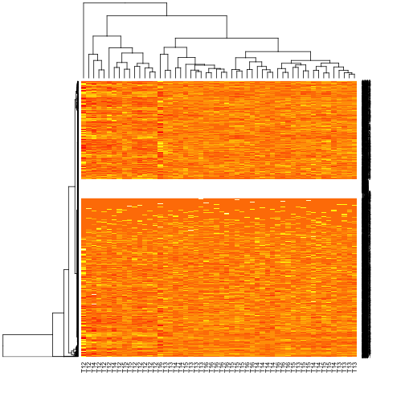
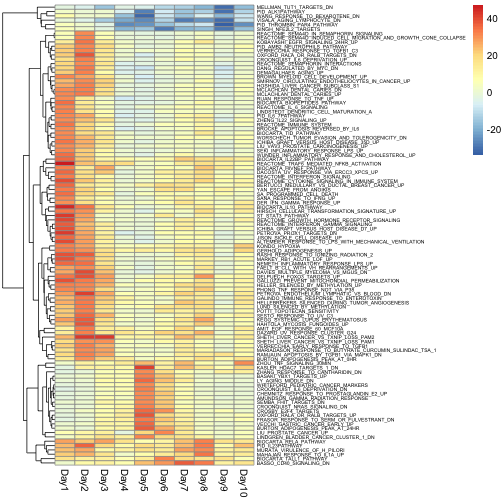

Creates the R markdown files.

```r
library("knitr")
opts_chunk$set(tidy = TRUE, cache = TRUE, messages = FALSE) 
spin(hair = 'CobbMareaHW4.R', format = 'Rmd') 
file.rename('CobbMareaHW4.md', 'CobbMareaHW4.Rmd')
library(data.table)
library(pheatmap)
```


Loads bioconductor packages
```r
source("http://bioconductor.org/biocLite.R")
biocLite()
```

```
## BioC_mirror: http://bioconductor.org
## Using Bioconductor version 3.0 (BiocInstaller 1.16.1), R version 3.1.1.
```

```r
library(limma)
library(BiocInstaller)
library(GSEABase)
```

Loads GEO libraries and specific dataset
```r
library(GEOmetadb)
library(GEOquery)
```

Download database only if it's not done already
```r
if (!file.exists("GEOmetadb.sqlite")) {
    getSQLiteFile()
}
gse <- getGEO("GSE45735", GSEMatrix = TRUE, destdir = "Data/GEO")
pd <- pData(gse[[1]])
getGEOSuppFiles('GSE45735', makeDirectory=FALSE, baseDir = 'Data/GEO/')
```

Note the regular expression to grep file names
```r
files <- list.files(path = "Data/GEO/", pattern = "GSE45735_T.*.gz", 
    full.names = TRUE)
```

Read in gzip-compressed, tab-delimited files
```r
file_list <- lapply(files, read.table, sep = "\t", header = TRUE)
```

Subset to only those rows where Gene contains only non-space characters
```r
# This addresses problems with T14 file containing 28 invalid
# rows at end of file
file_list <- lapply(file_list, function(file_list) subset(file_list, 
    grepl("^[^[:space:]]+$", Gene)))
```

Remove duplicated rows
```r
file_list_unique <- lapply(file_list, function(x) {
    x <- x[!duplicated(x$Gene), ]
    x <- x[order(x$Gene), ]
    rownames(x) <- x$Gene
    x[, -1]
})
```

Take the intersection of all genes
```r
gene_list <- Reduce(intersect, lapply(file_list_unique, rownames))
file_list_unique <- lapply(file_list_unique, "[", gene_list, 
    )
matrix <- as.matrix(do.call(cbind, file_list_unique))
```

Clean up the pData
```r
pd_small <- pd[!grepl("T13_Day8", pd$title), ]
pd_small$Day <- sapply(strsplit(gsub(" \\[PBMC\\]", "", pd_small$title), 
    "_"), "[", 2)
pd_small$subject <- sapply(strsplit(gsub(" \\[PBMC\\]", "", pd_small$title), 
    "_"), "[", 1)
colnames(matrix) <- rownames(pd_small)
```

Note that I add one to the count
```r
new_set <- ExpressionSet(assayData = matrix + 1)
pData(new_set) <- pd_small
```

Fitting the model using limma and voom
```r
design <- model.matrix(~subject + Day, new_set)
new_set_voom <- voom(new_set, design = design)
lm <- lmFit(new_set_voom, design)
eb <- eBayes(lm)
tt1 <- topTable(eb, coef = "DayDay1", number = "Inf")
tt2 <- topTable(eb, coef = "DayDay2", number = "Inf")
tt3 <- topTable(eb, coef = "DayDay3", number = "Inf")
tt4 <- topTable(eb, coef = "DayDay4", number = "Inf")
tt5 <- topTable(eb, coef = "DayDay5", number = "Inf")
tt6 <- topTable(eb, coef = "DayDay6", number = "Inf")
tt7 <- topTable(eb, coef = "DayDay7", number = "Inf")
tt8 <- topTable(eb, coef = "DayDay8", number = "Inf")
tt9 <- topTable(eb, coef = "DayDay9", number = "Inf")
tt10 <- topTable(eb, coef = "DayDay10", number = "Inf")
```

Adds FDR cutoff of 0.01
```r
sum(tt1$P.Value < 0.01)
sum(tt2$P.Value < 0.01)
sum(tt3$P.Value < 0.01)
sum(tt4$P.Value < 0.01)
sum(tt5$P.Value < 0.01)
sum(tt6$P.Value < 0.01)
sum(tt7$P.Value < 0.01)
sum(tt8$P.Value < 0.01)
sum(tt9$P.Value < 0.01)
sum(tt10$P.Value < 0.01)
```


```r
base <- tt1$P.Value < 0.01
sum(base)
final <- new_set[base, ]
dim(final)
```

```
## Features  Samples 
##     1611       54
```

```r
final_eset <- pData(final)
```

Order dataset by time
```r
final_sort <- final_eset[order(final_eset$Day), ]
```

Sets column names and order for heatmap
```r
col_order <- rownames(final_sort)
col_names <- final_sort$subject
data <- exprs(final)
dt <- as.data.table(data)
setcolorder(dt, col_order)
data <- data.matrix(dt)
colnames(data) <- col_names
heatmap(data)
```

 

```r
# Part 4 of the assignment. Running GSEA analysis using Camera
c2_set <- getGmt("GSEA-sets/c2.all.v4.0.symbols.gmt")
gene_ids <- geneIds(c2_set)

# Camera requires gene-indices.  
if (exists("ids2indices")) {
    sets_indices <- ids2indices(gene_ids, rownames(new_set))
}
if (exists("symbols2indices")) {
    sets_indices <- symbols2indices(gene_ids, rownames(new_set))
}
res <- vector("list", length = 10)
for (i in 1:10) {
    contrast <- paste0("DayDay", i)
    cont_matrix <- makeContrasts(contrast, levels = design)
    res[[i]] <- camera(new_set_voom, sets_indices, design = design, 
        contrast = cont_matrix, sort = FALSE)
}
```

```r
PValue <- sapply(res, function(x) {
    ifelse(x$Direction == "Up", -10 * log10(x$PValue), 10 * log10(x$PValue))
})
rownames(PValue) <- rownames(res[[1]])
PValue_max <- rowMax(abs(PValue))
PValue_small <- PValue[PValue_max > 30, ]
anno <- data.frame(Time = paste0("Day", 1:10))
rownames(anno) <- colnames(PValue_small) <- paste0("Day", 1:10)
pheatmap(PValue_small, cluster_cols = FALSE, fontsize_row = 5)
```

 

